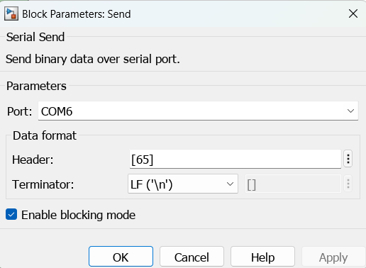
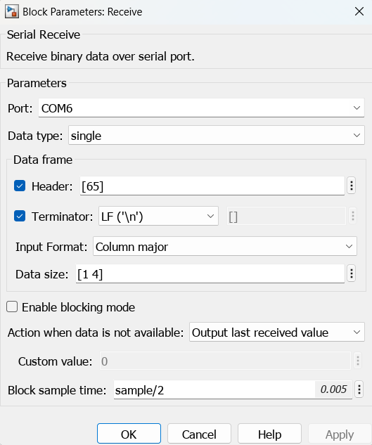

# simulink_com_serial
 - Serial communication library with Esp32 and matlab simulink

**Por algum motivo obscuro fica bugado com Arduino Uno**

## Configurando a ESP (código disponível na pasta "Example")

```cpp
#include <SimulinkSerial.h>

#define BAUDRATE    115200  // baudrate definido no simulink
#define LEN_RECEIVE 4       // quantidade de elementos recebidos
#define LEN_SEND    4       // quantidade de elementos enviados
#define HEADER      'A'     // header da mensagem
#define FOOTER      '\n'    // footer da mensagem
#define SAMPLETIME  20      // tempo de amostragem em millis

SimulinkSerial<double> simSerial(BAUDRATE, LEN_RECEIVE, LEN_SEND, HEADER, FOOTER, SAMPLETIME);

void setup(){
    // nao precisa fazer nada

    // CUIDADO!
    // nao use Serial.begin() com outro baudrate aqui
}

void loop(){
    // recebe os dados
    bool erro = simSerial.receive_package();

    // caso tenha algum problema na comunicação erro = true
    // if(erro) return;

    /*
        seu codigo manipulando os dados recebidos vai aqui

        use [index] ou .received(index) para acessar os dados do pacote recebido
        e   (index, data) ou .to_send(index, data) para adicionar dados no pacote enviado
    
        check sum ex:
        if((simSerial[0] + simSerial[1] + simSerial[2]) != simSerial[3]) return;
    */

    // define os dados a serem enviados
    simSerial(0, simSerial[0]);
    simSerial(1, simSerial.received(1));
    simSerial.to_send(2, simSerial[2]);
    simSerial.to_send(3, simSerial.received(3));

    // envia os dados
    simSerial.send_package();

    // espera o tempo de amostragem
    simSerial.wait_sample();
}
```

### Defina as variáveis que deseja usar (você precisará defini-las no arquivo do Simulink depois):

```cpp
#define BAUDRATE    115200  // baudrate definido no Simulink
#define LEN_RECEIVE 4       // quantidade de elementos recebidos
#define LEN_SEND    4       // quantidade de elementos enviados
#define HEADER      'A'     // header da mensagem
#define FOOTER      '\n'    // footer da mensagem
#define SAMPLETIME  20      // tempo de amostragem em millis
```

- BAUDRATE é a velocidade da comunicação serial desejada.
- LEN_RECEIVE e LEN_SEND são a quantidade de dados que deseja enviar e receber na comunicação.
- HEADER e FOOTER são usados para identificar o começo e o final dos bytes enviados.
- SAMPLETIME é a taxa de amostragem do seu modelo Simulink.

### Crie o objeto serial que vai usar no seu código, definindo o tipo de dado que deseja enviar e receber:

```cpp
SimulinkSerial<double> simSerial(BAUDRATE, LEN_RECEIVE, LEN_SEND, HEADER, FOOTER, SAMPLETIME);
```
No exemplo, estamos usando double, mas você pode definir com int8_t, uint8_t, int16_t, etc.

- [ ] **No seu void setup não precisa configurar nada, mas cuidado, você não pode definir o serial com um baudrate diferente do definido no objeto.**

### Para receber o pacote de bytes, você usa:
```cpp
bool erro = simSerial.receive_package();
```
A função retorna um valor booleano indicando se recebeu os dados corretamente utilizando o header e o footer.

### Para adicionar dados ao pacote que deseja enviar, você pode utilizar:

[index] ou .received(index) para acessar os dados do pacote recebido.
(index, data) ou .to_send(index, data) para adicionar dados no pacote enviado.

```cpp
simSerial(0, simSerial[0]);
simSerial(1, simSerial.received(1));
simSerial.to_send(2, simSerial[2]);
simSerial.to_send(3, simSerial.received(3));
```

### E então, para enviar o pacote por serial, use:

```cpp
simSerial.send_package();
```

### Finalmente, use:

```cpp
simSerial.wait_sample();
```
Isso garante que o seu loop ficará com a mesma taxa de amostragem que definiu no Simulink.

## Configurando a comunicação no Simulink (arquivo disponível na pasta "Example")


1. Configure os blocos "*Serial Configuration*", "*Serial Send*" e "*Serial Receive*" com as configurações definidas no código.
2. Use "*Vector Concatenate*" para concatenar todos os dados que deseja enviar.
3. "*Zero-Order Hold*" interpola os dados recebido com a taxa de amostragem que deseja (usei 20 millis no exemplo).
4. Converta seu vector de dados para o tipo definido no código (double no meu caso).
5. Envie os dados utilizando "*Serial Send*".
6. Leia os bytes recebidos utilizando "*Serial Receive*".
7. Separe os bytes recebidos usando "*Demux*".

## Configuração dos Blocos

### *Serial Configuration*


- Defina a porta serial da sua esp32 conectada

### *Serial Send*


- O *Header* 'A' definido no codigo é 65 em ASCII e o *Footer* '\n' é a quebra de linha.

### *Serial Receive*


- Defina o tipo do dado recebido, o *header* 'A', o *footer* '\n' e em *data size* a quatidade de dados recebidos em uma matriz coluna.

# Utilizando o código e o arquivo de exemplo, ao abrir o scope, você terá esse plot:

